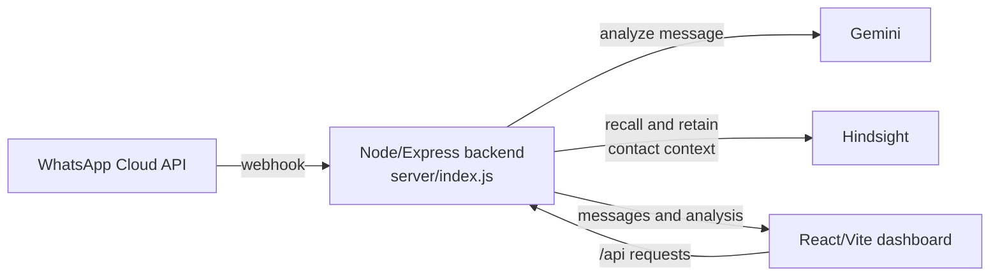

# Astra AI

Astra AI is a WhatsApp customer-response agent with a React/Vite dashboard and a Node/Express backend. It receives WhatsApp messages, analyzes them with Gemini, and uses Hindsight to remember useful context for each contact. The frontend is intended for Vercel, while the backend runs on Render.

The deployed backend is:

```text
https://astra-ai-server-uraa.onrender.com
```

## Architecture



The backend keeps the in-memory dashboard store for the current process, while Hindsight supplies persistent memory across restarts and conversations. The frontend sends analysis requests to `POST /api/analyze`; provider configuration stays on the backend.

## How Hindsight Memory Is Used

Each WhatsApp contact gets a separate Hindsight memory bank named `whatsapp-<waId>`. This prevents one contact's preferences or purchase history from being recalled for another contact.

### What gets retained

After a message is analyzed, `retainMessage()` in [`server/memory.js`](server/memory.js) stores an observation containing the contact and message identifiers, message text, timestamp, and available analysis such as priority, sentiment, category, AI summary, and suggested replies.

### What gets recalled

Before Gemini analyzes a new message, `recallMemories()` queries the contact's bank using the current message. The relevant returned memories are passed into the analysis prompt, so the response can use earlier details such as a budget, preferred screen size, product interests, or a previous concern.

The `/api/demo/conversation` endpoint demonstrates this with ten scripted turns. It returns the memories available at the start of each turn, making the memory behavior visible. The scripted conversation is sample data, not a claim about a real customer.

## Setup

1. Install the dependencies already declared by the repository:

   ```bash
   npm install
   ```

2. Copy the placeholder configuration file:

   ```powershell
   Copy-Item .env.example .env
   ```

3. Fill `.env` with your own local values. Use placeholders in documentation and keep real credentials only in the untracked `.env` file. Server-side values include `GEMINI_API_KEY`, the WhatsApp settings, and the Hindsight settings. For Hindsight, configure either a self-hosted URL or the Hindsight Cloud URL and its API key.

4. Start the backend in one terminal:

   ```bash
   npm run server
   ```

5. Start the Vite frontend in another terminal:

   ```bash
   npm run dev
   ```

The local backend listens on the configured `PORT` (the example uses `3001`). For a deployed frontend, `/api` requests should be rewritten to the Render backend URL.

## Demo endpoint

Run the ten-turn sample laptop-shopping conversation:

```bash
curl -X POST http://localhost:3001/api/demo/conversation \
  -H "Content-Type: application/json" \
  -d '{"waId":"demo-alice-001","senderName":"Alice"}'
```

The response contains `memoryEnabled`, each turn's `memoriesAtTurnStart`, the analysis, and the model/fallback metadata. To run the same sample without recalling or retaining Hindsight memories, add `?memory=off`:

```bash
curl -X POST "http://localhost:3001/api/demo/conversation?memory=off" \
  -H "Content-Type: application/json" \
  -d '{"waId":"demo-alice-001","senderName":"Alice"}'
```

To inspect the memories for a contact:

```bash
curl http://localhost:3001/api/demo/memories/demo-alice-001
```

## Other API endpoints

- `GET /api/status`
- `GET /api/messages`
- `POST /api/analyze`
- `POST /api/send`
- `GET /api/whatsapp/webhook`
- `POST /api/whatsapp/webhook`
- `POST /api/demo/conversation`
- `GET /api/demo/memories/:waId`

## Notes

- The local message store is in memory and resets when the server restarts.
- Hindsight memory is scoped by WhatsApp contact ID.
- The laptop demo uses the catalog in [`server/catalog.json`](server/catalog.json); generated replies should be grounded in the available catalog data.
- Outbound WhatsApp sending is text-only in the current implementation.
